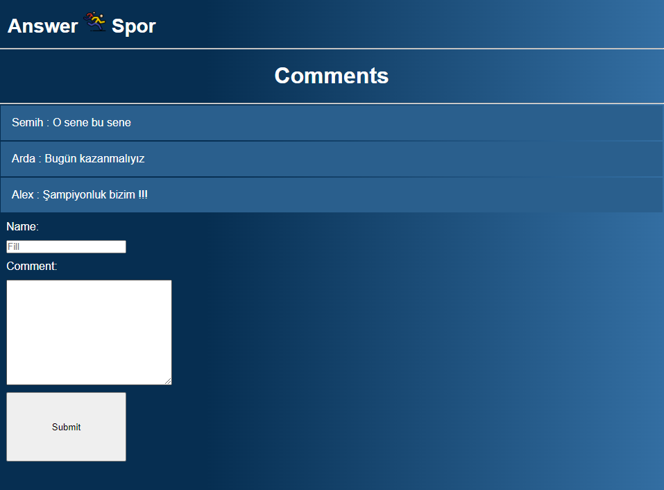

# Answer Spor

## İnternet programlama dersi ödevi.

İsmail Keyvan 201913171030 

npm install -g node-modules ile node modullerini indirerek npm run dev komutuyla http://localhost:5000/ adresinde başlatabilirsiniz.

- Verileri canlı olarak takip edebilir ve yorumlarda bulunabilirsiniz. 

